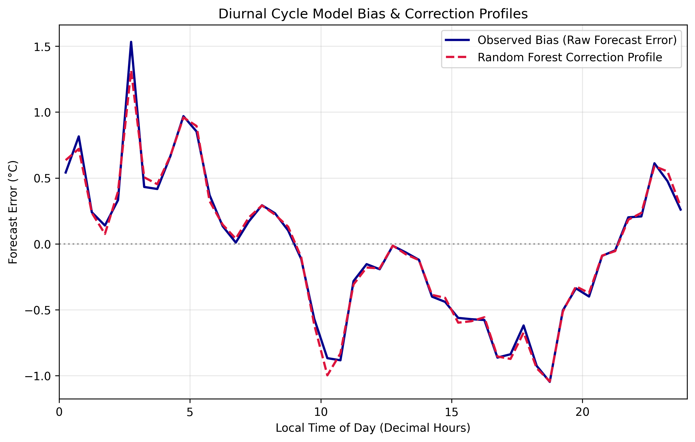
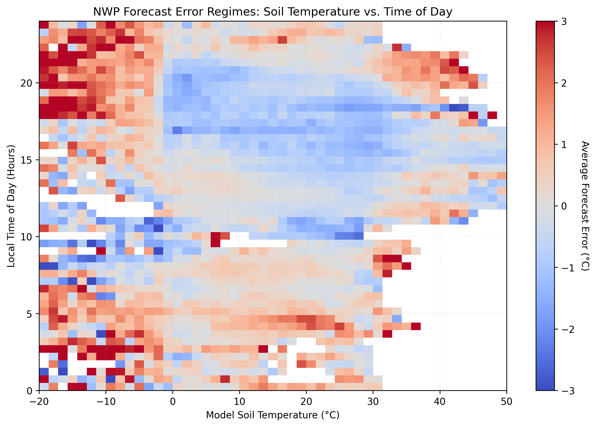

# Statistical Post-Processing: Correcting NWP Model Biases Using Random Forests

An end-to-end machine learning pipeline that builds an operational "correction layer" for the European Centre for Medium-Range Weather Forecasts (ECMWF) high-resolution atmospheric model. By leveraging non-linear feature interactions, this pipeline mitigates systematic diurnal and land-surface temperature biases, improving raw numerical weather prediction (NWP) 2m-temperature forecasts by **~7%**.

---

## 🌍 The Problem Statement
Physics-based Numerical Weather Prediction (NWP) models are highly sophisticated but frequently suffer from localized, systematic biases due to complex land-atmosphere boundary layers. Two prominent issues include:
1. **Diurnal Cycle Bias:** Consistent overestimation or underestimation of air temperatures at specific local hours (e.g., radiative cooling errors during dawn or solar forcing errors at peak afternoon).
2. **Land Surface Sub-Grid Effects:** Inability to perfectly parameterize heat transfers from extreme ground temperatures (e.g., frozen or scorching soils) into the adjacent 2-meter air column.

This project implements data-driven statistical post-processing to isolate and predict these physical errors, applying a corrective delta to the raw physics-based forecast.

---

## 📊 Dataset & Architecture
The pipeline ingests and synchronizes over **5 million operational data points** streaming directly from the ECMWF cloud object store, tracking raw forecast variables alongside observational truths across ~8,000 global weather stations:

* **Target Variable ($y$):** `forecast_error` — The absolute difference between the 36-hour ECMWF 2m-temperature forecast and ground-truth station observations ($^\circ\text{C}$).
* **Feature 1 ($X_1$):** `time_of_day` — Local time in decimal hours to capture systematic diurnal waves.
* **Feature 2 ($X_2$):** `soil_temperature` — Numerical model soil surface temperature ($^\circ\text{C}$) to account for land-surface interactions.

---

## 📈 Diagnostic Data Insights

### 1. The Diurnal Bias Wave


### 2. Multi-Feature Land-Surface Interaction


### Engineering Pipeline Structure
To transform the academic source data into a scalable software asset, the architecture is structured cleanly into decoupled, reusable production modules:
```text
weather_bias_correction/
│
├── .cache/                # High-performance local storage for raw synced chunks
├── src/
│   ├── data_prep.py       # Robust streaming, type-coercion, and matrix reshaping 
│   ├── evaluation.py      # Automated benchmarking and performance calculation
│   └── train_pipeline.py  # Orchestration engine for split validation and training
└── README.md