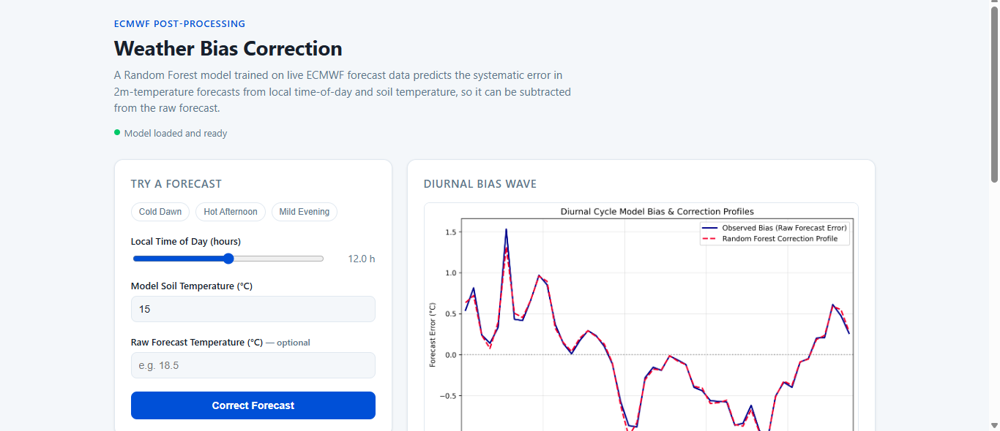
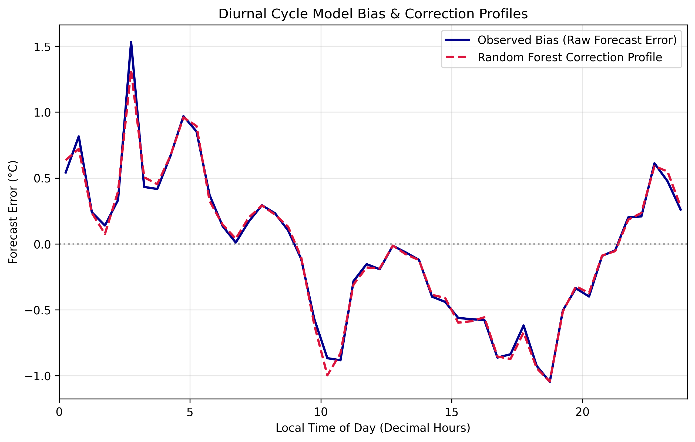
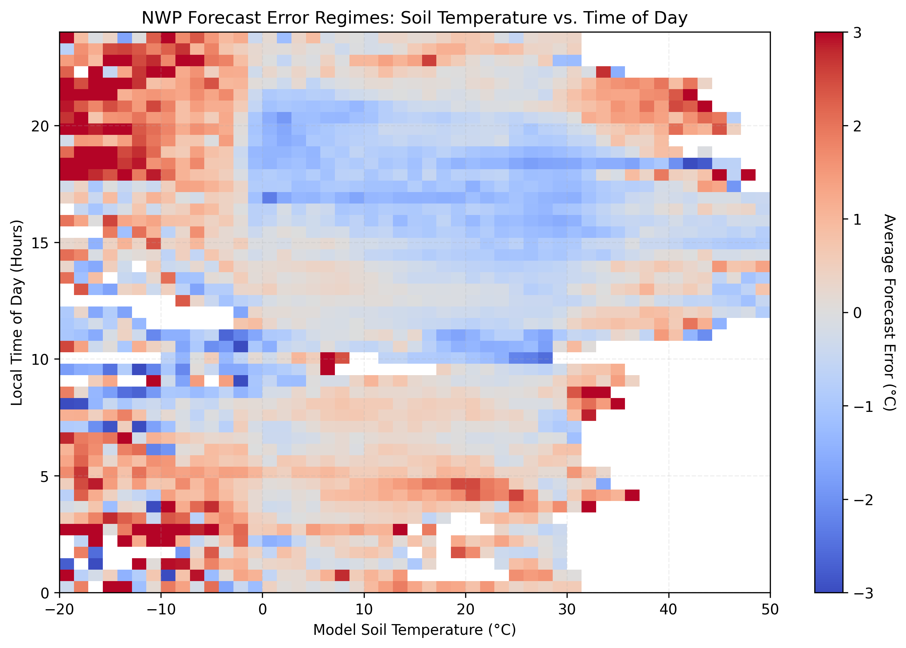

# Weather Bias Correction

**Statistical post-processing for ECMWF numerical weather forecasts, using a Random Forest to learn and correct systematic 2m-temperature bias.**


**Live demo:** https://weather-bias-prediction.onrender.com



---

## The problem

Physics-based numerical weather prediction (NWP) models are highly sophisticated but frequently carry localized, systematic biases from imperfect land-atmosphere boundary layer physics:

1. **Diurnal cycle bias** — consistent over/under-estimation of air temperature at specific local hours (e.g. radiative cooling errors at dawn, solar forcing errors in peak afternoon).
2. **Land-surface sub-grid effects** — imperfect parameterization of heat transfer from extreme ground temperatures (frozen or scorching soils) into the adjacent 2-meter air column.

Rather than re-running the physics, this project treats the bias itself as a learnable, data-driven signal: a Random Forest is trained to predict the *forecast error* directly from two cheap, always-available features, and that prediction is subtracted from the raw forecast as a correction.

## How it works

```
raw ECMWF forecast  ─┐
                      ├─►  predicted_error = RandomForest(time_of_day, soil_temperature)
time_of_day           │
soil_temperature  ────┘

corrected_temperature = raw_forecast_temperature − predicted_error
```

- **Target:** `forecast_error` — the difference between the ECMWF 36-hour 2m-temperature forecast and the ground-truth station observation (°C).
- **Feature 1:** `time_of_day` — local time in decimal hours, capturing the diurnal wave.
- **Feature 2:** `soil_temperature` — model soil surface temperature (°C), capturing land-surface interaction effects.

Training data streams directly from the ECMWF cloud object store: **5M+ operational records** across ~8,000 global weather stations.

## Diagnostic insights

| Diurnal Bias Wave | Time × Soil Temperature Interaction |
|---|---|
|  |  |

The Random Forest's correction profile (left, dashed red) tracks the observed diurnal bias wave closely, and the interaction heatmap (right) shows the two features have a genuinely non-linear, joint effect on error — the motivation for a tree-based model over a simple linear correction.

## Try it

The app ships with a single-page UI (`static/index.html`) served directly by the FastAPI backend — no separate frontend deployment needed. Enter a time of day and soil temperature (or pick a preset), and it calls the live model to return the predicted bias and, if you supply a raw forecast temperature, the corrected value.

## Project structure

```
weather_bias_correction/
├── src/
│   ├── data_prep.py       # Streaming download, caching, type-coercion, feature alignment
│   ├── train_pipeline.py  # Train/test split, Random Forest fitting, model + plot export
│   ├── evaluation.py      # Baseline vs. model metrics (MAE, RMSE)
│   ├── plots.py           # Diagnostic visualizations (diurnal wave, interaction heatmap)
│   ├── api.py             # FastAPI app: prediction endpoints + serves the UI
│   └── paths.py           # Shared path constants
├── static/
│   └── index.html         # Single-page UI (form + live diagnostics)
├── plots/                 # Generated diagnostic charts (committed for the README/UI)
├── models/
│   └── rf_model.joblib    # Trained model artifact (committed for deployment)
├── main.py                # Production entrypoint (binds to Render's $PORT)
├── render.yaml            # Render Blueprint (build + start commands)
├── Procfile               # Alternate process declaration (Heroku-style)
└── requirements.txt
```

## API reference

| Method | Endpoint         | Description                                            |
|--------|------------------|---------------------------------------------------------|
| GET    | `/`              | Serves the UI                                            |
| GET    | `/health`        | Model load status, for uptime checks                     |
| POST   | `/predict`       | Single prediction — see request/response below           |
| POST   | `/predict/batch` | Batch prediction over a list of samples                  |
| GET    | `/docs`          | Interactive OpenAPI docs (Swagger UI)                     |

**Request**
```json
{
  "time_of_day": 14.0,
  "soil_temperature": 32.0,
  "raw_forecast_temp": 18.5
}
```

**Response**
```json
{
  "predicted_forecast_error": 1.0,
  "corrected_temperature": 17.5
}
```

`raw_forecast_temp` is optional — omit it to get just the predicted error.

## Running locally

```bash
python -m venv venv
source venv/Scripts/activate   # Windows: venv\Scripts\activate
pip install -r requirements.txt

# (Optional) retrain the model from live ECMWF data — takes a while, streams ~5M rows
python src/train_pipeline.py

# Run the API + UI
python main.py
# → http://127.0.0.1:8000
```

The repo ships with a pre-trained `models/rf_model.joblib` and pre-generated plots, so `python main.py` alone is enough to run the full app without retraining.

## Deployment

Deployed on [Render](https://render.com) as a single web service via `render.yaml`:

```yaml
buildCommand: pip install -r requirements.txt
startCommand: python main.py
```

`main.py` binds to `0.0.0.0` on Render's `$PORT` automatically.

## Model performance

Evaluated against a zero-correction baseline (i.e. trusting the raw ECMWF forecast as-is) on a held-out 20% test split, the Random Forest correction reduces mean absolute error by **~7%**.

`train_pipeline.py` prints a full MAE/RMSE comparison table (baseline vs. model) on every run — see `src/evaluation.py`.

## Tech stack

Python · pandas · NumPy · scikit-learn · SciPy · Matplotlib · FastAPI · Uvicorn · Render
